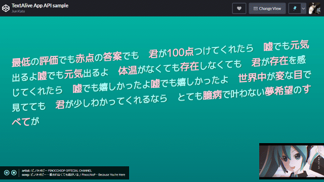

# TextAlive App API lyric sheet example

インタラクティブな歌詞カードを実装した TextAlive App API のサンプルコードです。
発声にあわせて歌詞が表示され、歌詞をクリックするとそのタイミングに再生がシークします。
また、このアプリが TextAlive ホストと接続されていなければ再生コントロールを表示します。

ビルドツールを何も使わず `script` タグで TextAlive App API を読み込んでいます。CodePenにアクセスすると、Webブラウザ上でこのアプリケーションのソースコードを編集できます。

- デモページ: https://textalivejp.github.io/textalive-app-lyric-sheet/
- CodePen: https://codepen.io/arcatdmz/pen/abNXJgG

TextAlive ホストと接続された状態をテストするには [TextAlive App Debugger](https://developer.textalive.jp/app/run/?ta_app_url=https%3A%2F%2Ftextalivejp.github.io%2Ftextalive-app-lyric-sheet%2F&ta_song_url=https%3A%2F%2Fwww.youtube.com%2Fwatch%3Fv%3DygY2qObZv24) のページにアクセスしてください。



## 違う楽曲で試すには

TextAlive App API で開発されたWebアプリケーションは、（特定の楽曲向けに作り込んでいない限り）URLのクエリパラメタで `ta_song_url={楽曲のURL}` を指定すると異なる楽曲で演出を試せます。

- [ブレス・ユア・ブレス by 和田たけあき feat. 初音ミク](https://textalivejp.github.io/textalive-app-lyric-sheet/?ta_song_url=https%3A%2F%2Fwww.youtube.com%2Fwatch%3Fv%3Da-Nf3QUFkOU)
- [グリーンライツ・セレナーデ by Omoi feat. 初音ミク](https://textalivejp.github.io/textalive-app-lyric-sheet/?ta_song_url=https%3A%2F%2Fwww.youtube.com%2Fwatch%3Fv%3DXSLhsjepelI)

## 開発

[Node.js](https://nodejs.org/) をインストールしている環境で以下のコマンドを実行すると、開発用サーバが起動します。

```sh
npx http-server .
```

Node.jsに依存せず、その他のHTTPサーバを使うこともできます。

## ビルド

ビルドツールは不要です。

[サンプルコードのデモページ](https://textalivejp.github.io/textalive-app-lyric-sheet/) は [GitHub Pages](https://pages.github.com/) で、このリポジトリ直下のファイルが提供されています。

## TextAlive App API


TextAlive App API は、音楽に合わせてタイミングよく歌詞が動くWebアプリケーション（リリックアプリ）を開発できるJavaScript用のライブラリです。

TextAlive App API について詳しくはWebサイト [TextAlive for Developers](https://developer.textalive.jp/) をご覧ください。

---
https://github.com/TextAliveJp/textalive-app-lyric-sheet
